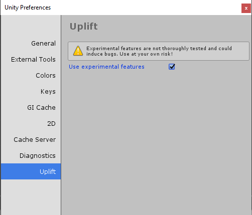

.. _enable_experimental_features:

Enable experimental features
============================

To enable experimental features, you need to go to the Unity Preferences menu.
To access it, you need to go to ``Edit > Preferences``, and go to the "Uplift" tab in the window that appears.
You then need to tick the box "Use experimental features".

