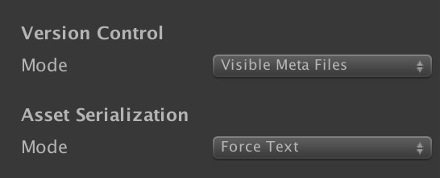

Preparing a project for Uplift usage
====================================

The following recommendations are very good to follow if you use Unity, even without **Uplift**. Not following them would make it **impossible** to use Uplift effectively.

1. Use version control. **Rationale**: you don't want to lose your code

2. Configure your Editor to use Visible metas (`Edit --> Project Settings --> Editor` then *Version Control* set as **Visible Meta Files**). **Rationale**: you would need them if you were working in a team. Uplift will need them to proceed with managing your dependencies, in particular because they contain **GUIDs**.

3. Configure your Editor to save assets in text mode (`Edit --> Project Settings --> Editor` then *Asset Serialization* set as **Force Text**). **Rationale**: source controls will have a harder time dealing with binary blobs.

Result:

