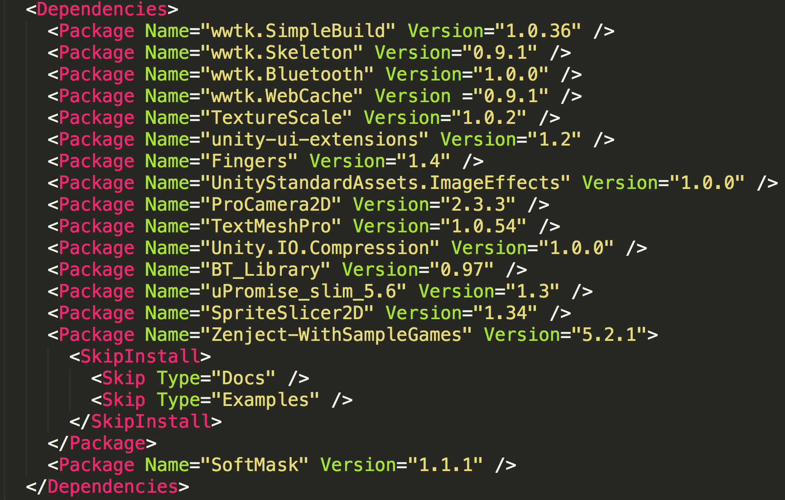

Uplift Overview
===============

Uplift is a dependency manager for Unity. It allows you to shift from importing your dependencies manually to declaring your dependencies and let Uplift do the work of managing your dependencies (and their own dependencies). At the core of your project will lie a list of dependencies:

When using Uplift, you will be having 2 main roles:

* a *packager* role, where you take external or internal unity packages and place them into Uplift repositories. These packages become them usable through Uplift.

* a *user* role, where you use Uplift to install those packages into your project.

.. Note:: As time go, your main role will be *user*. A package needs to be packaged only once and the task of packaging the packages will become more and more automated thanks to tooling.