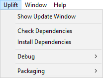

Use Uplift Menus
================

* Show Update Window:

	Displays a very simple Window showing information about each dependency and its install status, including potential updates.

* Check Dependencies:

	Checks and log in the console information about each dependency and its install status, including potential updates.

* Install Dependencies:

	Installs missing dependencies.

* Debug:

	* Refresh Upfile:

		Forces Uplift to refresh its Upfile.

	* Install from lockfile:

		Installs dependencies exactly as they are stated in the lockfile.

	* Nuke All Packages:
		
		Removes all assets installed by Uplift (and tracked in the Upbring file). Uplift makes sure to not delete a directory it created if you added a file into it.

* Packaging:

	* Create Export Package Definition:

		Creates an Asset under Assets/ for you to describe the package you want to export

	* Export Defined Packages:

		Exports all of the packages described in your package definition assets.

	* Export Package:

		Displays a very simple Window allowing you to create package definitions.