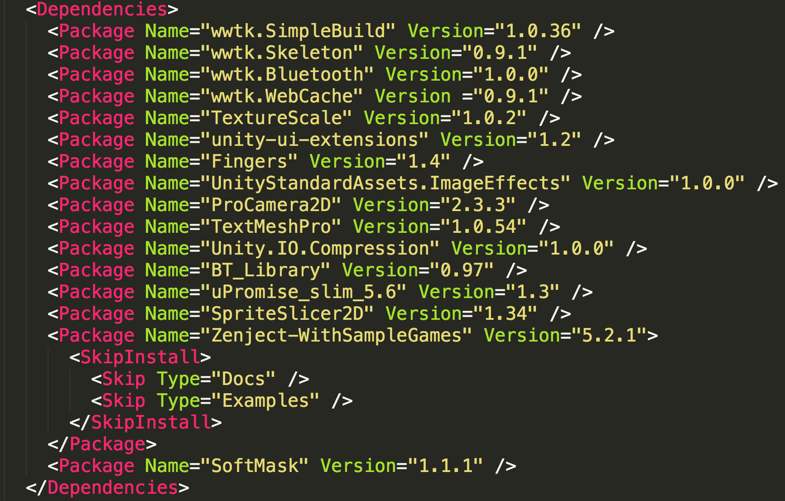

Uplift Overview
===============

Uplift is a dependency manager for Unity. It allows you to shift from importing your dependencies manually to declaring your dependencies and let Uplift do the work of managing your dependencies (and their own dependencies). At the core of your project will lie a list of dependencies:

